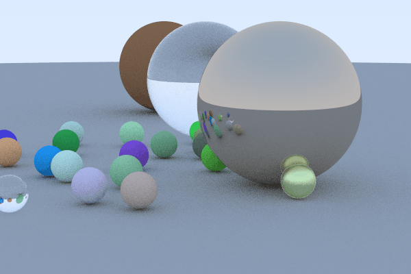

# Gallery

# Goals
- [x] encoding output to GIF
- [x] render multiple frames
- [x] allow objects to move
- [ ] detect collisions between objects
- [ ] handle collisions
- [ ] parse input from stdin/file to allow for fast configs
- [x] AABB trees to speed up tracing and collision detection
