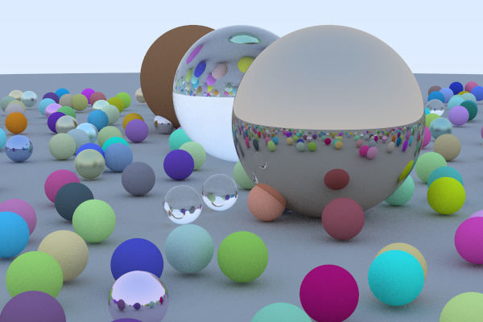

# Goals
- encoding output to GIF
- render multiple frames
- allow objects to move
- detect collisions between objects
- handle collisions
- parse input from stdin/file to allow for fast configs
- AABB trees to speed up tracing and collision detection
